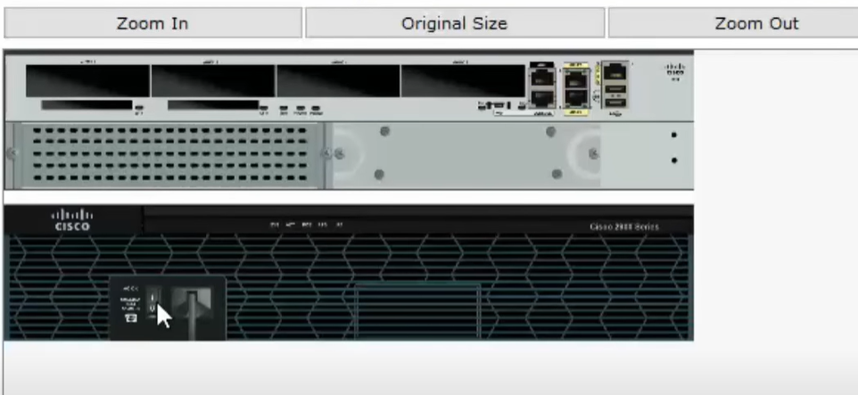
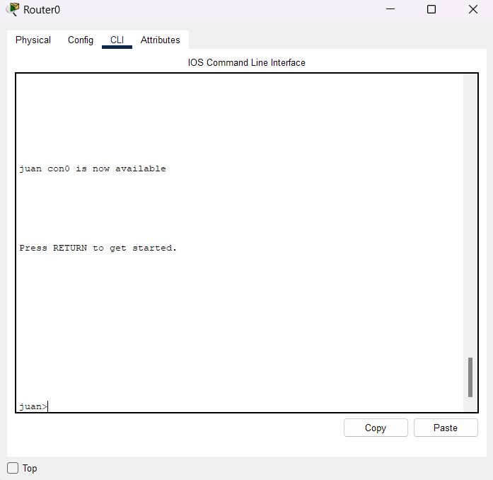

# Recuperar el acceso restaurando la contraseña en un Router de Cisco 💻

Brizuela González Juan Eduardo
Interconexión de Redes

---

##### 1. Lo primero que tenemos que hacer, es apagar y encender nuestro Router.

---

### 2. Entrar a la CLI de Cisco.

    

---

##### 3. Mientras está en el proceso de "booteo" o de inicialización, presionar el comando `CTRL + C`. Con esto, entraremos en el modo `rommon 1`. El modo "rommon", es el modo de recuperación.

---

#### 4. Estando en este modo, tendremos que introducir el siguiente comando `confreg 0x2142`.

Con este comando el router omite la configuración de inicio almacenada en NVRAM durante su secuencia de inicio.

Esta función se utiliza normalmente durante un procedimiento de recuperación de contraseña.

---

### 5. Posteriormente, introducimos en la CLI: `reset`

---

#### 6. Esperamos a que vuelva a inicializarse el router, y con esto, podremos iniciar al router con su configuración de fábrica.

---

#### 7. Para verificar esto, entramos al modo global del router con `ena`, después hacemos un `show run`, y claramente podemos ver que el router está vacío.

---

#### 8. No hay porqué preocuparse. Si se desea restaurar la información del router sin la contraseña asignada, se introduce el comando: `copy start run`

---

### 9. Con base en lo aprendido en la clase, pueden establecer su nueva password/secret.

---

### 10. Sin embargo, no hemos terminado porque la configuración sigue en 0x2142.

Así que, entrando al modo de configuración `copy start run`, introducimos el siguiente comando: `config-register 0x2102`. La configuración predeterminada de fábrica para el registro de la configuración.

---

#### 11. Finalmente, hacemos un `do reload` o `exit` && `do reload` para iniciar de nuevo el router. Para asegurarnos de la configuración, hacemos un `do show version`

---

# <!--fit--> ¡Gracias!
